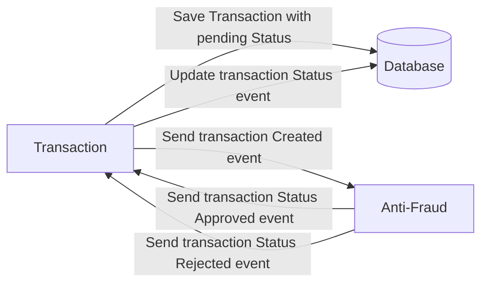
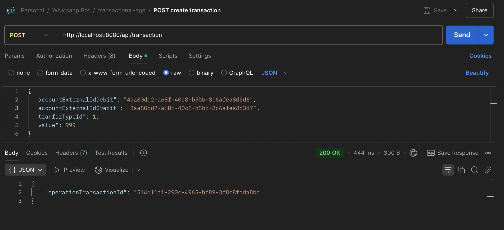
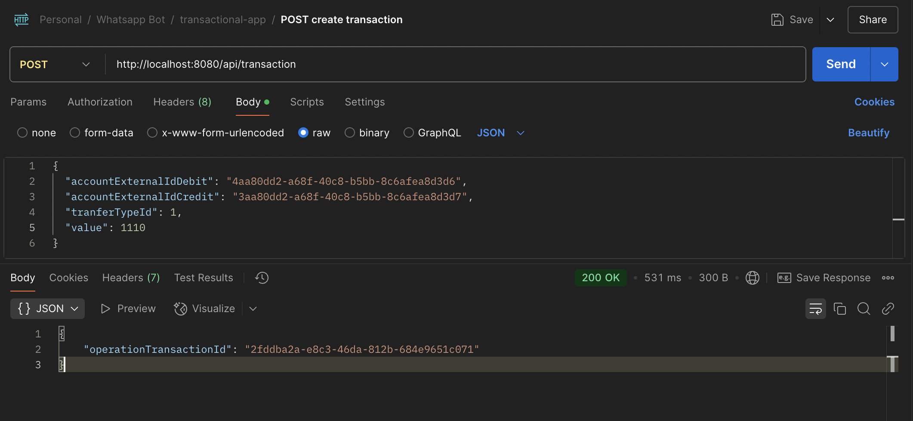
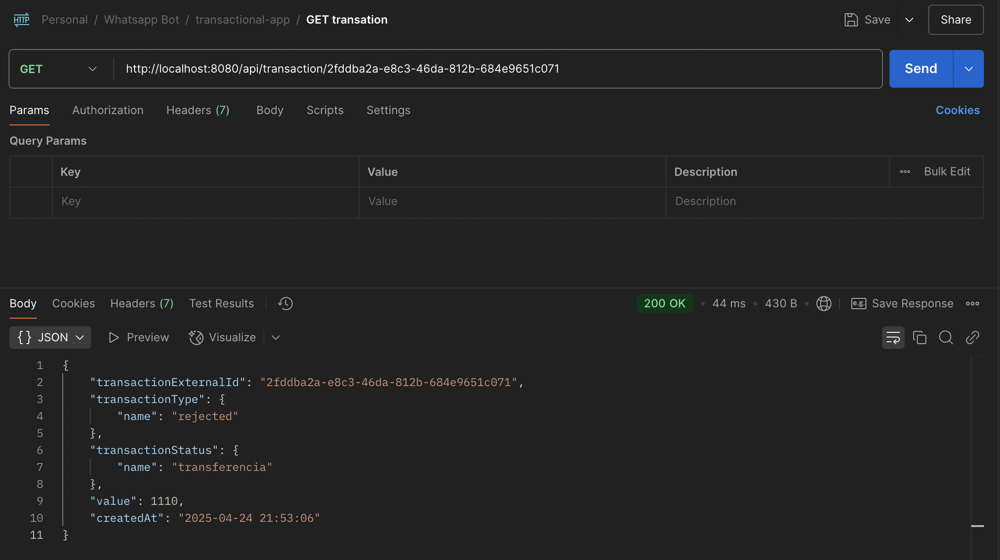
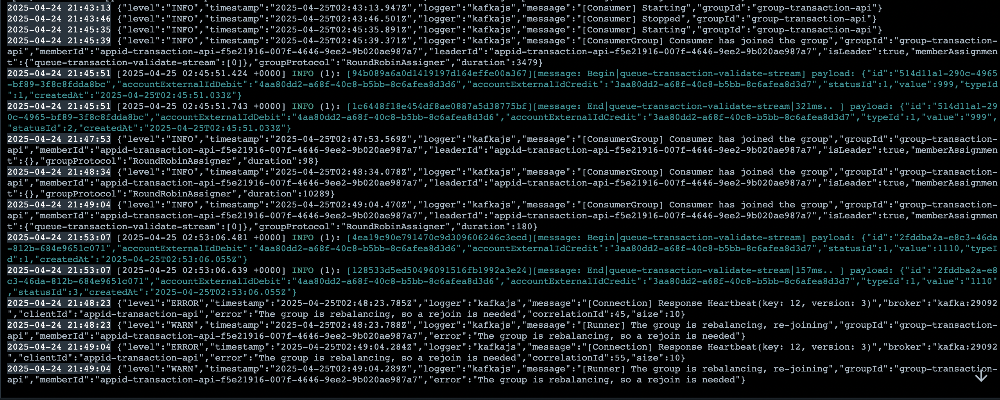

# Yape Code Challenge 🚀

Our code challenge will let you marvel us with your Jedi coding skills 😄.

Don't forget that the proper way to submit your work is to fork the repo and create a PR 😉 ... have fun !!

- [Problem](#problem)
- [Tech Stack](#tech_stack)
- [Send us your challenge](#send_us_your_challenge)

# Problem

Every time a financial transaction is created it must be validated by our anti-fraud microservice and then the same service sends a message back to update the transaction status.
For now, we have only three transaction statuses:

<ol>
  <li>pending</li>
  <li>approved</li>
  <li>rejected</li>  
</ol>

Every transaction with a value greater than 1000 should be rejected.



# Tech Stack

<ol>
  <li>Node. You can use any framework you want (i.e. Nestjs with an ORM like TypeOrm or Prisma) </li>
  <li>Any database</li>
  <li>Kafka</li>  
</ol>

We do provide a `Dockerfile` to help you get started with a dev environment.

You must have two resources:

1. Resource to create a transaction that must containt:

```json
{
  "accountExternalIdDebit": "Guid",
  "accountExternalIdCredit": "Guid",
  "tranferTypeId": 1,
  "value": 120
}
```

2. Resource to retrieve a transaction

```json
{
  "transactionExternalId": "Guid",
  "transactionType": {
    "name": ""
  },
  "transactionStatus": {
    "name": ""
  },
  "value": 120,
  "createdAt": "Date"
}
```

## Optional

You can use any approach to store transaction data but you should consider that we may deal with high volume scenarios where we have a huge amount of writes and reads for the same data at the same time. How would you tackle this requirement?

You can use Graphql;

# Send us your challenge

When you finish your challenge, after forking a repository, you **must** open a pull request to our repository. There are no limitations to the implementation, you can follow the programming paradigm, modularization, and style that you feel is the most appropriate solution.

If you have any questions, please let us know.

## Steps to run

1. run docker compose

   ```bash
   docker-compose up --build -d
   ```
2. you wait to starting services

   ```bash
   # wait 1min
   ```
3. connect to favorite IDE and run postgresql scripts

   ```sql
   CREATE EXTENSION "uuid-ossp";

   CREATE TABLE transaction_types (
     id INT PRIMARY KEY,
     name VARCHAR(100) NOT NULL
   );

   INSERT INTO transaction_types (id, name) VALUES (1, 'transferencia');

   create TABLE transaction_statuses (
     id INT PRIMARY KEY,
     name VARCHAR(20) UNIQUE NOT NULL
   );

   INSERT INTO transaction_statuses (id, name) VALUES (1, 'pending'), (2, 'approved'), (3, 'rejected');

   CREATE TABLE transaction_audit_logs (
     id SERIAL PRIMARY KEY,
     transaction_id UUID NOT NULL,
     previous_status VARCHAR(20),
     new_status VARCHAR(20),
     changed_at TIMESTAMP DEFAULT NOW(),
     reason TEXT,
     source_service VARCHAR(50)
   );

   create TABLE transactions (
     id UUID PRIMARY key default uuid_generate_v4(),
     account_external_id_debit UUID NOT NULL,
     account_external_id_credit UUID NOT NULL,
     transaction_type_id INT NOT null references transaction_types(id) on delete no action,
     value NUMERIC(10, 2) NOT null,
     transaction_status_id INT NOT NULL references transaction_statuses(id) on delete no action,
     created_at TIMESTAMP DEFAULT NOW()
   );

   ```
4. create kafka topic

   ```bash
   docker exec -it app-nodejs-codechallenge-kafka-1 kafka-topics --create \
       --bootstrap-server kafka:9092 \
       --replication-factor 1 \
       --partitions 1 \
       --topic queue-transaction-validate-stream
   ```
5. start ms fraud-validation-stream

   ```bash
   docker start app-nodejs-codechallenge-ms-fraud-validation-stream-1
   ```
6. test application

   ```bash
   # Registration success transfer
   curl --location 'http://localhost:8080/api/transaction' \
   --header 'Content-Type: application/json' \
   --data '{
     "accountExternalIdDebit": "4aa80dd2-a68f-40c8-b5bb-8c6afea8d3d6",
     "accountExternalIdCredit": "3aa80dd2-a68f-40c8-b5bb-8c6afea8d3d7",
     "tranferTypeId": 1,
     "value": 999
   }'

   # Registration reject transfer
   curl --location 'http://localhost:8080/api/transaction' \
   --header 'Content-Type: application/json' \
   --data '{
     "accountExternalIdDebit": "5aa80dd2-a68f-40c8-b5bb-8c6afea8d3d7",
     "accountExternalIdCredit": "6aa80dd2-a68f-40c8-b5bb-8c6afea8d3d8",
     "tranferTypeId": 1,
     "value": 1001
   }'

   # Query transfer status (get transactionId from preview response)
   curl --location 'http://localhost:8080/api/transaction/{transactionId}' \
   --header 'accept: application/json'

   # Showing audit transaction
   # SQL
   # select * from transaction_audit_logs

   ```

## Screenshots

1. success transfer




2. reject transfer





3. kafka logs


